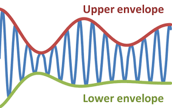
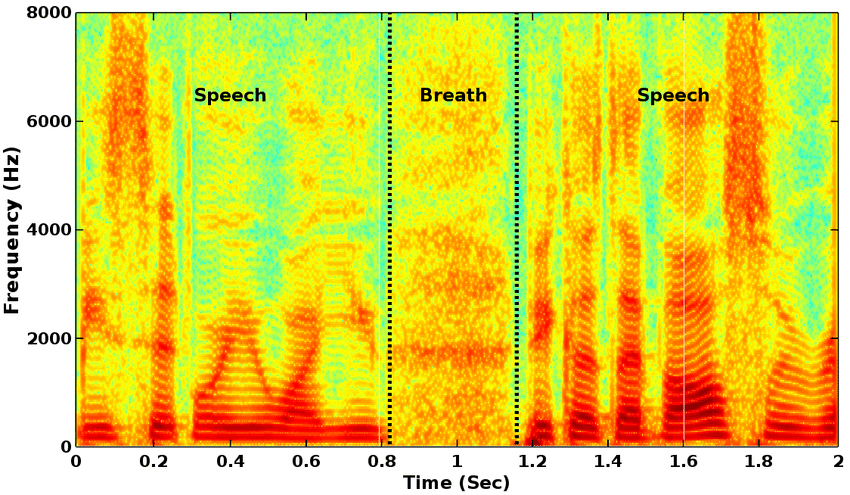
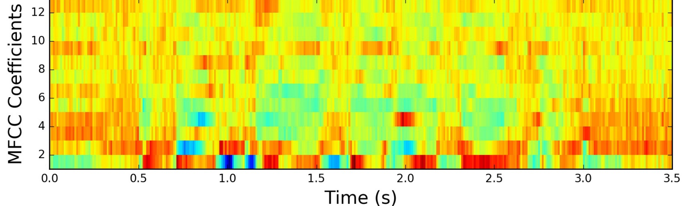

# Klasifikacija audio signala primenom Neuronskih mreza
https://github.com/Selich/OnioNN

Nikola Selić IN 43/2017

Dusan Urošević IN 16/2017

Osnovni cilj projekta je formirati neuronske mreze (CNN i RNN) za klasifikaciju zvuka na osnovu njegovog izvora. 

### Dataset
Početni - 300 .wav fajlova, razlicitih dužina. Po 30 fajlova za 10 klasa instrumenata. 
Predstavlja podskup FSDKaggle2018 seta. Klase koje su zastupljene u datasetu su Saxophone, Violin_or_fiddle, Hi-hat, Snare_drum, Acoustic_guitar, Double_bass, Cello, Bass_drum, Flute i Clarinet. Svi snimci su samplovani sa frekvencijom od 44,1kHz i imaju 16bit bit depth. Podskup je uzet, ne samo zbog vremena treniranja, vec i zato sto na ovim kalasama su potvrđene ground_truth labele za snimke. U okviru ovog notebook-a predstavljena je obrada originalnih .wav fajlova. Dve glavne izmene su downsampling na 16kHz, kako bismo zadržali niže frekvencije (do 8kHz), koje sadrže relevantnije podatke, i eliminisanje takozvanog "dead space"-a u zvuku gde je intenzitet zvuka zanemarljiv. Rezultat obrade su 300 istoimenih .wav fajlova u "clean" direktorijumu.


### Cilj modela 
Cilj modela je da tačno kalsifikuje zvuke iz prethodno navedenih klasa. Ulaz mreže ce biti MFCC spektrogrami formirani na osnovu prethodno obrađenih .wav fajlova. Očekivani izlaz je labela instrumenta koji je proizveo zvuk. Preciznije, iz obradjenih .wav fajlova selektujemo po 0,1s iz nasumično odabranih snimaka. Dalje, nad njima primenjujemo MFCC transformaciju sa sirinom prozora od 25ms, pomerajem od 10ms i 13 mfc koeficijenata. 

Dobijeni spektrogram se zatim preoblikuje tako da može da se koristi kao ulaz za CNN i RNN. Kod CNN je samo potrebno dodati jos jednu dimenziju kako bi  spektrogram bio posmatran kao jednokanalna slika. Metrika uspešnosti modela ce biti preciznost u klasifikaciji nad validacionim podacima.

##  Teorijski uvod
**Zvuk** predstavlja promenu vazdušnog pritiska s vremenom. Kako po prirodi predstavlja analogni signal, potrebno je izvršiti njegovu diskretizaciju, da bi mogli da ga trajno sačuvamo. Diskretizacija se vrši po vremenskoj osi i po mogucim vrednostima elongacije tj. otklona od ravnotežnog polozaja.

**Sampling rate**- Predstavlja broj vrednosti signala koji beležimo svake sekunde. Cesto se koristi 44kHz, zato što omogućava da se verno rekonstruišu sve frekvencije koje čovek čuje.

**Bit depth**- Predstavlja količinu memorije (u bitima) koja je rezervisana za pojedinačnu vrednost. Ako je bit depth npr. 16 to znači da možemo da zabeležimo 2^16 različitih vrednosti otklona.

Kao signal, zvuk se može opisati pomoću svoje amplitude (maksimalnog otklona) i frekvencije (brzine oscilacije). Pored ovih karakteristika, svaki zvuk ima i svoje harmonike. Oni predstavaljaju prateće frekvencije koje nastaju kao posledica fizičkih karakteristika izvora i stvaraju manje nepravilnosti u signalu na osnovu kojih možemo da prepoznamo izvor zvuka (npr. ista nota na klaviru i gitari se mogu lako razaznati).  

Jedna alternativna metoda za prepoznavanje izvora bi bila *Amplitude envelope*. Ona predstavlja niz maksimalnih vrednosti amplitude po vremenskim intervalima koji sadrže više vrednsoti zvuka. 



Ova metoda je najpogodnija za kratke zvukove koji mogu da se posmatraju u kontektstu ADSR modela. Ovde posmatramo takozvane Attack, Decay, Sustain i Release faze u amplitude envelope i na osnovu njihovog trajanja određujemo izvor.

### Spektrogram
Opštija metoda za klasifikaciju zvuka, za koju smo se odlučili, je primena podataka iz frekventnog domena. Konkretno, ulazi  mreža su **spektrogrami**. 



Spektrogram predstavlja intenzitet zvuka kao funkciju vremena i frekvencije, odnosno za svaki trenutak mi dobijamo informaciju o tome koliko je energetski zastupljena svaka frekvencija u zvuku. Najčešće, umesto trodimenzionalnog grafa, koristi se 2D predstava gde boja predstavlja intenzitet određene frekvencije. Na datom primeru može se primetiti da u ljudskom govoru su najzastupljenije niže frekvencije.

Spektrogrami se formiraju primenom **Furieove transformacija** nad nizom kraćih podintervala (<0,1s). Ovim se, iz signala datog u vremenskom domenu (.wav fajl), izvlače karakteristike u frekventom domenu. Širina intervala je izabrana tako da zvuk ima priblizno konstantne karakteristike. Prilikom prozoriranja, koristimo Hanovu prozorsku funkciju kako bismo izbegli curenje spektra, odnosno javljanje novih frekvencija u podacima koje bi remetile treniranje. Susedni intervali će se preklapati, kako nebi doslo do gubitka podataka na krajevima intervala. 

Dodatno, koristićemo *Mel Filter Bank*. Odnosno od svih frekvencija čiju energiju nalazimo primenom furieove transformacija zadržavamo samo odredjeni podskup (mi smo izabrali 26) frekvencija, pri čemu ce niže frekvencije biti više zastupljene. Ovo radimo u cilju emuliranja ljudksog sluha. Na kraju koristimo *Descrete Cosine Transform* kako bismo eliminisali korelacije unutar spektrograma. Krajnji rezultat, koji će biti ulaz mreza, je Spektrogram dimenzija 13x9. 13 predstavlja broj **Mel-frequency cepstral** koeficijenata, tj. reprezentativnih frekvencija dobijenih primenom DSC-a, a 9 predstavlja broj podintervala u audio snimku od 0,1s u kojima evaluiramo intenzitete frekvencija. Ovi spektrogrami ce biti formirani na osnovu prethodno obradjenih .wav fajlova. 



## Struktura projekta

Projekat se sastoji od više python i jupyter-notebook datoteka. Izgled strukture datoteka je:

```bash
├───data
│   ├───clean
│   ├───meta
│   ├───pickles
│   └───small_train
├───models
└───src
    ├───.ipynb_checkpoints
    └───__pycache__
```

- /data
    - Sadrži neobrađene i očišćene podatke
- /models
    - Sadrži prethodno istrenirane modele
- /src
    - Sadrži samu implementaciju neuralnih preža, predprocesiranje podataka kao i neophodni jupyter-notebook-ovi

## Pokretanje

Potrebne biblioteke za pokretanje projekta mogu se instalirati pomoću package managera:
- conda
```bash
conda install --file requirements.txt
```

- pip
```bash
pip install -r requirements.txt
```

NAPOMENA: Potrebna je dostupnost Nvidia GPU zbog upotrebe CUDA bindinga za Tensorflow.

Metode za predprocesiranje su implementovane u datoteci data_processing.py, dok metode sa plotovanje u plot.py datoteci. Sama analiza podataka je izvršena u Data Analysis.ipynb notebook-u:
```bash
jupyter-notebook Data Analysis.ipynb
```

Treniranje modela se pokreće aktivacijom jupyper notebook-a sa datotekom Model.ipynb, i zatim pokretanje svih ćelija unutar notebook-a:
```bash
jupyter-notebook Model.ipynb
```

Izvršavanje predikcije se izvršava pokretanjem predict.py
```bash
python predict.py
```

### Video material
- [Audio Signal Processing](https://www.youtube.com/playlist?list=PL-wATfeyAMNqIee7cH3q1bh4QJFAaeNv0)
- [Deep Learning for Audio with Python](https://www.youtube.com/watch?v=fMqL5vckiU0&list=PL-wATfeyAMNrtbkCNsLcpoAyBBRJZVlnf)
- [Deep Learning for Audio Classification](https://www.youtube.com/watch?v=Z7YM-HAz-IY&list=PLhA3b2k8R3t2Ng1WW_7MiXeh1pfQJQi_P)

### Ostali materijali

[Notes](https://docs.google.com/document/d/1TwMF-A1KDAO62_rVFWCpWVGNhkPmtN_4y_vy368_los/edit)
[Kaggle](https://www.kaggle.com/selich/ori-classification-of-sounds-using-cnn)

